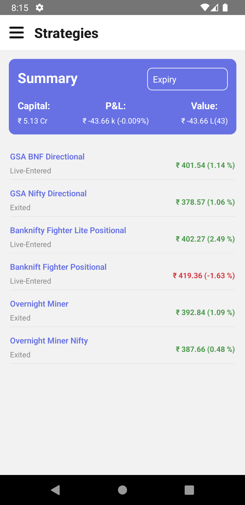

# Codling Change

Codling Change

## Features

- List Of Company
- Real Time Data

## Usage

To use the application, simply open the app.

## Run

To run the application locally

1. Clone this repository to your local machine:
2. cmd `yarn`
3. cmd `yarn android`
4. create APK with cmd `yarn release:android`
5. APK can be found in `root/apk/app-release.apk`
